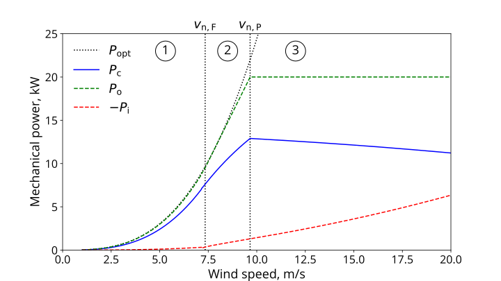
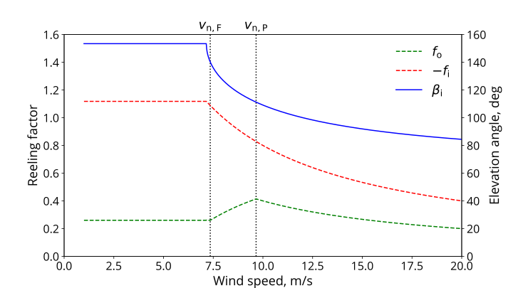

# Performance analysis

Source code for the performance analysis of an airborne wind energy system [[1]](#References). The file `powercurve_const_LoD_in.py` generates a continuous power curve for a pumping airborne wind energy system in three wind speed regimes. The control strategy was first proposed in [[2]](#References) and was extended in the chapter to account for constant elevation angles during the reel-out and reel-in phases.

</img>
</img>

In contrast to [[2]](#References), the reel-in phase is modeled for constant lift-to-drag ratio of the kite, resulting in a reel-in elevation angle varying with the wind speed. This setup is more appropriate for soft-kite systems with slow actuation and a required safe distance from a negative angle of attack.

The file `powercurve_const_beta_in.py` contains the alternative implementation, outlined in parts already in [[2]](#References), with a constant reel-in elevation angle, resulting in a lift-to-drag ratio that varies with the wind speed. This implementation might prove helpful in fixed-wing kite systems with fast actuation that can fly at negative and positive angles of attack.

## References

[1] Van der Vlugt, R., Peschel, J., Schmehl, R.:. Design and Experimental
Characterization of a Pumping Kite Power System. In: Ahrens, U., Diehl, M.,
Schmehl, R. (eds) Airborne Wind Energy. Green Energy and Technology. Springer,
Berlin, Heidelberg. Chap. 23, pp. 403-425, 2013 [https://doi.org/10.1007/978-3-642-39965-7_23](https://doi.org/10.1007/978-3-642-39965-7_23)

[2] Luchsinger, R.H.: Pumping Cycle Kite Power. In: Ahrens, U., Diehl, M., and Schmehl, R. (eds) Airborne Wind Energy. Green Energy and Technology. Springer, Berlin Heidelberg. Chap. 3, pp 47-64, 2013. [https://doi.org/10.1007/978-3-642-39965-7_3](https://doi.org/10.1007/978-3-642-39965-7_3).
